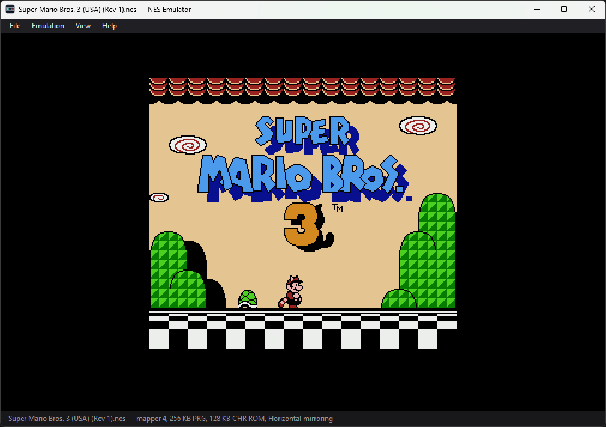

# NES Emulator

A Nintendo Entertainment System emulator written in C#, built around a cycle counted 6502 core, a picture unit that follows the beam and a sound unit with the real non-linear mixer.



Super Mario Bros. 3 on an MMC3 board: four switchable program slots, eight tile banks, and the line counter that splits the screen.

The console is a small, completely documented machine, which makes it an unusually honest thing to build: there is a right answer for every instruction, and published test programs exist to say whether you got it. This repository aims at those answers rather than at a screenshot that looks close enough — including where the answer is still no.

## What works

All three chips run, and commercial cartridges render and play.

- **6502 core** — every documented instruction plus the undocumented opcodes, driven by the bus: each cycle performs a real read or write, dummy reads included
- **Picture unit** — background and sprites, scrolling, palettes and the colour emphasis bits, sprite zero hit, per-dot sprite evaluation with the overflow bug, edge clipping, drawn one pixel per cycle as the beam sweeps
- **Sound unit** — two square waves with sweeps, triangle, noise and sample playback through the console's non-linear mixer, band limited before it reaches the sound card
- **Cartridges** — iNES and NES 2.0 parsing, including exponent sizes, separate save RAM chips and submappers, with mappers 0, 1, 2, 3, 4, 7, 9 and 10, which between them cover most of the library; the MMC3 filters A12 using actual CPU M2 edges, with selectable standard or alternate MMC3A IRQ behavior, and a selectable `$EE`/`$FF` model for the unstable `$AB` opcode
- **Save states and rewind** — a full console state, about five kilobytes compressed, and a minute of play to wind back through
- **Debugger** — a disassembler and execution trace that folds out beside the screen

How the interesting parts work, and which hardware quirks had to be reproduced rather than fixed, is in [how it works](docs/how-it-works.md).

## Accuracy

Two things are measured here. One is a suite of 779 offline checks. The other is the public test ROMs, which probe cycle-exact edges rather than just checking whether games run. They provide a reproducible measure of timing accuracy for specific hardware behavior. The full vblank/NMI, CPU interrupt, APU and MMC3 suites now pass with the chip revisions specified below.

| Measure | Passed | What it covers |
|---|---:|---|
| **CPU bus-cycle vectors** | **2,560,000 / 2,560,000** | Every one of the 256 opcodes: registers, memory, cycle counts, and each bus address, value and direction |
| **Processor behaviour and instruction timing** | **26 / 26** | Instruction behaviour, timing, page wrapping, dummy reads and writes, reset |
| Interrupt and video edge timing | 21 / 21 | NMI/BRK/IRQ overlap, vblank suppression, MMC3 scanline timing and both IRQ revisions |
| Sound unit timing | 8 / 8 | Frame-counter sequencing and the DMC prefetch buffer |
| **Public ROM total** | **55 / 55** | MMC3 revision and `$AB` profile selected to match each test's hardware target |
| Additional DMA suite | 2 / 2 | DMC/OAM collisions, transfer length and copied sprite data |
| Additional sprite suites | 16 / 16 | 11 sprite-zero-hit ROMs and 5 overflow behavior/timing ROMs |

The MMC3 tests require two incompatible IRQ behaviors. The runner selects alternate MMC3A for `6-MMC3_alt` and standard MMC3 for the other five, recording each profile in the report. ROM bytes stay unchanged, and ordinary cartridge loading defaults to standard MMC3.

The unstable `$AB` opcode (immediate LAX) has two different hardware reports behind it, so it is a selectable CPU profile rather than a single fixed answer: the `$EE` mask matches the [SingleStepTests vectors](https://github.com/SingleStepTests/65x02/tree/2f6980a2d95757486c7bee24355c360e40e2a224/nes6502), the `$FF` mask matches blargg's `03-immediate` ROM. Neither model passes both measures: `$EE` costs that one ROM, `$FF` costs 4,422 of the 10,000 `ab` vectors. The ROM table above was measured with the `$FF` profile and the vector total with the default `$EE` profile; every report names the profile it ran under. The emulator defaults to `$EE`, and the menu offers `$FF` per ROM.

The separate [DMA report](docs/dma-results.md), [DMA stop report](docs/dma-stop-results.md) and [sprite report](docs/sprite-results.md) keep the original 55-ROM denominator stable.

Every result, failure message and ROM checksum is in the [full report](docs/accuracy-results.md), and the per-opcode vector results in the [CPU vector report](docs/cpu-vector-results.txt). Measured on Windows x64 with .NET 9 on 2026-09-13. The [cycle-accuracy work log](docs/cycle-accuracy.md) records the clock model, completed checks and next targets.

### Beyond the standard suites

The table above is the bar the field uses, and it is met. [AccuracyCoin](https://github.com/100thCoin/AccuracyCoin) is a newer collection that goes considerably further: 144 tests aimed at one specific console — an RP2A03G processor with an RP2C02G picture unit — probing analog-level quirks such as sprite memory corruption, unstable store opcodes and the pre-render line's own sprite comparison. Almost none of it is behaviour a commercial game relies on.

**124 of its 144 judged tests pass**, with no timeouts, plus 3 of 3 in the DMA stop subset driven through the ROM's own menu. This is a research target rather than a measure of whether games run correctly, so it is reported here rather than beside the standard suites. The [itemized report](docs/accuracy-coin-results.md) names every remaining failure and its error code.

## Tests

```
dotnet run --project tests/NesEmulator.Tests      # 779 offline checks
dotnet run --project tests/NesEmulator.UiTests    # 95 input and menu checks
```

```
PASS  indirect jump reproduces the page wrap bug
PASS  absolute,X pays for crossing a page
PASS  rmw: performs the hardware double write
PASS  ppu: a frame is 89,342 cycles
PASS  render: the leftmost squares are clipped away
PASS  mmc3: the interrupt arrives on the counted line
PASS  state: replaying from a state is deterministic
...
779/779 passed
```

They cover the opcode table, every addressing mode, the signed overflow cases, branch and interrupt timing, all seven boards, the picture unit registers and mirroring, the sound unit down to its envelopes, the save state round trip and the rewind ring — and, end to end, a small program that writes a palette and a name table and is then checked pixel by pixel against what came out. Nothing is downloaded.

To reproduce the public ROM runs, fetch the pinned test data first:

```powershell
./tools/fetch-accuracy-tests.ps1
dotnet run -c Release --project tests/NesEmulator.Tests -- --ab-profile ff --rom-suite roms/accuracy docs/accuracy-results.md
dotnet run -c Release --project tests/NesEmulator.Tests -- --dma-suite roms/accuracy docs/dma-results.md
dotnet run -c Release --project tests/NesEmulator.Tests -- --sprite-suite roms/accuracy docs/sprite-results.md
```

The bus-cycle vectors are an optional download of roughly 1 GB:

```powershell
./tools/fetch-accuracy-tests.ps1 -IncludeCpuVectors
dotnet run -c Release --project tests/NesEmulator.Tests -- --ab-profile ee --cpu-vectors roms/cpu-vectors
```

The DMA stop tests use a separately pinned AccuracyCoin ROM, driven through its menu with controller input:

```powershell
./tools/fetch-accuracy-tests.ps1 -IncludeAccuracyCoin
dotnet run -c Release --project tests/NesEmulator.Tests -- --dma-abort-suite roms/accuracy-coin docs/dma-stop-results.md
dotnet run -c Release --project tests/NesEmulator.Tests -- --coin-suite roms/accuracy-coin docs/accuracy-coin-results.md
```

The second command runs the whole collection. It takes the page list, test order and result addresses from the ROM's own menu tables, so the report cannot drift from the cartridge, and each test runs from its own power-on.

## Running it

```
dotnet build NesEmulator.sln
dotnet run --project src/NesEmulator
```

Open a cartridge with **File → Open ROM**, or drop one on the window. `roms/demo.nes` is included: a handwritten cartridge that fills a screen with tiles, scrolls it from the frame interrupt, and sweeps a square wave in step with the scroll so there is something to hear as well. `tools/make-demo-rom.sh` builds it, with the full source listed in its comments.


| Control | Keys |
|---|---|
| Player one | Arrows = directions, X = A, Z = B, Enter = Start, Shift = Select |
| Player two | WASD = directions, G = A, F = B, R = Start, T = Select |
| Save / load state | F1 / F4 |
| Rewind | Hold Backspace |
| Pause | F5 |
| Reset | Ctrl+R |
| Mute / unmute | M |
| Debugger | F12 |

**Help → Controls** lists the same bindings in the app. Controller keys work even when a debugger control has focus; switching away from the emulator releases both controllers so buttons cannot stick.

For mapper 4 cartridges, **Emulation → MMC3 IRQ revision (restarts ROM)** selects standard MMC3B/C or alternate MMC3A behavior. Changing it restarts the cartridge and clears rewind history, preserving pause. Opening another ROM starts with the standard profile. Saves retain the chosen revision and must be loaded with that same selection; older v2–v5 saves use standard MMC3.

**Emulation → $AB opcode profile (restarts ROM)** chooses which unstable-silicon model the immediate `LAX` opcode follows: the `$EE` mask (the default, matching the SingleStepTests vectors) or the `$FF` mask (matching blargg's `03-immediate` ROM). It behaves like the MMC3 selection: changing it restarts the cartridge, clears rewind history and preserves pause, and opening another ROM returns to `$EE`. Saves record the profile and must be loaded with the same one; v2–v9 saves are treated as `$EE`. No commercial game depends on this opcode.

For a copy that runs on a machine with no .NET installed:

```
dotnet publish src/NesEmulator/NesEmulator.csproj -p:PublishProfile=win-x64-single-file
```

That leaves one 49 MB `publish/NesEmulator.exe`, which also accepts a cartridge path on the command line. Building needs the .NET 9 SDK; the shell needs Windows, while the core targets plain `net9.0` and has no platform dependencies.

**No commercial ROMs are included and none will be.** Anything dropped into `roms/` stays out of version control apart from the demo cartridge.

## Layout

- `src/NesEmulator.Core/` — the console, with no user interface dependencies, so the tests can run it headless
  - `Cpu/` — the opcode table, the processor and the disassembler
  - `Ppu/` — the picture unit and the colour table
  - `Apu/` — the sound unit, its five channels and the resampler
  - `Cartridges/` — iNES and NES 2.0 parsing, and the mappers
  - `Memory/` · `Input/` · `RewindBuffer.cs`
- `src/NesEmulator/` — the Windows Forms shell and the wave output
- `tests/` — the console test runner and the Windows input checks
- `tools/` — the demo cartridge generator and the test-data fetcher

## License

MIT. See [LICENSE](LICENSE).
